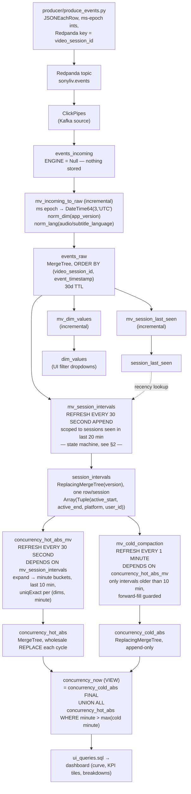
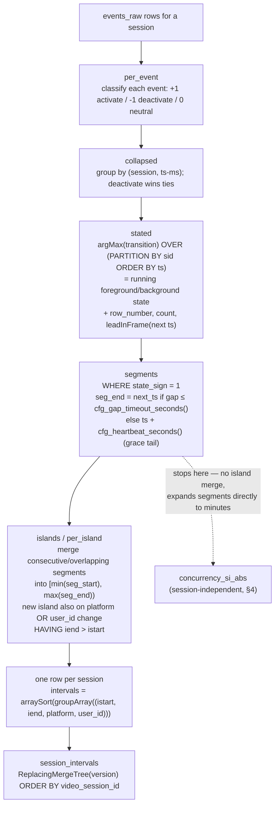
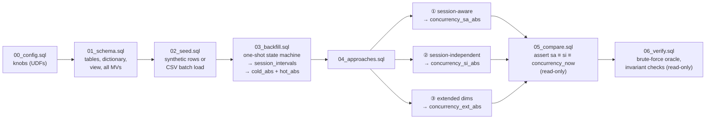
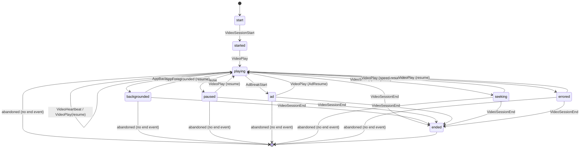

# Snorlax data flow

Traced directly from the executable pipeline (`producer/produce_events.py`,
`schema/*.sql`, `schema/migrations/run_sql.py`) — not from the design docs.

## 1. End-to-end (live path)



Cold and hot are kept disjoint by minute (`concurrency_now`'s `WHERE`
clause), so nothing is ever double-counted across the tiers, and cold minutes
are never recomputed once written (append-only forward fill).

`mv_session_intervals` and `mv_cold_compaction` are both refreshable MVs and
both require `APPEND` on their `REFRESH ... TO <table>` clause: without it,
a refreshable MV fully *replaces* its target table's contents on every
cycle instead of accumulating. `mv_session_intervals`'s query is scoped to a
20-minute recency window, so missing `APPEND` there silently wiped every
session outside that window — including the full one-shot historical
backfill and the seeded CSV batch — on every 30s cycle.

## 2. The state machine (how "truly active" is derived)

This exact CTE chain appears three times, verbatim, because three different
consumers need it: the live `mv_session_intervals` (`01_schema.sql` D2), the
offline one-shot `03_backfill.sql`, and the session-independent comparison
job (`04_approaches.sql` §2, which stops one step earlier — see §4 below).



1. **`per_event`** — classify every raw event into a transition:
   - **`+1` (activate)**: `event_type IN (VideoSessionStart, VideoPlay,
     AppForegrounded)` OR `event IN (resume, speed-resume, AdResume)`.
     `VideoSessionStart` seeds a session active from its very first event —
     heartbeats before an explicit `VideoPlay` aren't dropped, and a session
     that never emits an explicit `Play` still counts.
   - **`-1` (deactivate)**: `event_type IN (AppBackgrounded, VideoSessionEnd,
     VideoError, VideoPause, AdBreakStart)` OR `event IN (pause, speed-pause,
     AdPause)`. Pause has no coarse `event_type` in the raw feed — it rides
     in the `event` column — so both columns are checked.
   - **`0` (neutral)**: everything else, notably `VideoHeartbeat`. A
     heartbeat never resets a deactivated state, so a paused-but-still-
     heartbeating session stays excluded.

2. **`collapsed`** — group by `(session, event_timestamp)` (same-millisecond
   ties): `if(min(transition) < 0, -1, max(transition))` — a deactivation at
   the same instant always wins over an activation, a deterministic
   tie-break for simultaneous events.

3. **`stated`** — `argMax(transition, if(transition!=0, ts, epoch)) OVER
   (PARTITION BY sid ORDER BY ts ROWS UNBOUNDED PRECEDING)` carries the last
   non-neutral transition forward, i.e. this window function *is* the
   running foreground/background state. Also computes `row_number()`,
   `count()`, and `leadInFrame(ts)` (the next event's timestamp) per session.

4. **`segments`** — for every row where `state_sign = 1` (currently active),
   compute how long that active stretch lasts:
   - if it's the session's last event (`rn = n`): `ts + cfg_heartbeat_seconds()`
     (a lone/final heartbeat still occupies a grace tail).
   - else if the gap to the next event is `<= cfg_gap_timeout_seconds()`
     (90s default): extend straight to `next_ts` (no gap penalty).
   - else: `ts + cfg_heartbeat_seconds()` (the stretch ends at grace tail;
     the silence beyond that is inactive).

5. **`islands`** / **`per_island`** — merge consecutive/overlapping segments
   for the same session into single `[min(seg_start), max(seg_end))`
   intervals (`new_island` flags a gap **or** a platform/user_id change vs.
   the previous segment via `lagInFrame(...)`; `sum(new_island) OVER (...)`
   assigns an island id). Forcing a boundary on platform/user_id change means
   `any(platform)`/`any(user_id)` per island is never a lossy collapse across
   genuinely different values — ~95 sessions (0.9%) span >1 platform and
   ~120 span >1 user_id (e.g. a device switch mid-session). `HAVING iend >
   istart` drops zero-length islands.

6. Collapse per session into **one row** — `arraySort(iv -> iv.1,
   groupArray((istart, iend, platform, user_id)))` — which is what makes
   `session_intervals` safe under `ReplacingMergeTree(version) ORDER BY
   video_session_id`: a refresh producing fewer islands than before still
   fully replaces the row, so no stale interval can survive `FINAL`. Note
   platform/user_id ride *inside* the tuple, not as separate session-level
   columns — each interval carries its own, exact by construction from step 5.

## 3. Minute expansion (interval → serving row)

Every consumer of `session_intervals` (hot MV, cold MV, `03_backfill.sql`,
`04_approaches.sql`) unpacks the tuple as `iv.1 AS active_start, iv.2 AS
active_end, iv.3 AS platform, iv.4 AS user_id` (platform/user_id are no
longer plain columns on `session_intervals` itself) and expands
`[active_start, active_end)` into buckets the same way:

```sql
toStartOfInterval(active_start, toIntervalSecond(cfg_bucket_seconds()))
  + toIntervalSecond(number * cfg_bucket_seconds())     -- number from ARRAY JOIN range(...)
```
where `range(...)`'s upper bound is
`dateDiff('second', bucket_start(active_start), bucket_start(active_end - 1ms)) / cfg_bucket_seconds() + 1`
— subtracting 1ms before flooring `active_end` means an interval ending
exactly on a bucket boundary doesn't spuriously claim the next bucket. Both
the hot and cold MVs prune `session_intervals` to their respective time
window **before** this `ARRAY JOIN` (not after), so a 30s/60s refresh never
re-scans/re-expands a session's entire retained history.

Every path then does `GROUP BY (dims..., minute, content_id)` with
`toUInt32(uniqExact(video_session_id))` and `toUInt32(uniqExact(user_id))` —
this is the "once-per-minute dedupe": a session with several segments/islands
touching the same minute still counts as exactly one concurrent viewer.

## 4. Offline pipeline (what `run_sql.py --all` actually runs)



- **`00`/`01`** — knobs, then every table/view/dictionary/MV (idempotent,
  `IF NOT EXISTS`/`CREATE OR REPLACE`).
- **`02`** — Section A (default) inserts a handful of synthetic sessions
  with `now()`-relative timestamps directly into `content_dim`/`events_raw`,
  then `SYSTEM REFRESH VIEW` + `SYSTEM WAIT VIEW` forces the live MVs to run
  once so `concurrency_now` shows a curve immediately. Section B (commented
  out) instead `TRUNCATE`s and bulk-loads the real hackathon CSVs via
  `FROM INFILE`.
- **`03`** — a **one-shot, non-MV** version of the same state machine over
  *all* of `events_raw` (no 20-min recency filter), writing
  `session_intervals` fully, then splitting the minute expansion at a
  watermark (`max(event_timestamp)` bucket − `cfg_hot_window_seconds()`)
  into `concurrency_cold_abs` (≤ watermark) and `concurrency_hot_abs` (>
  watermark).
- **`04`** — three independent population jobs, each `TRUNCATE` + `INSERT`:
  1. **Session-aware** (`concurrency_sa_abs`) — reads `session_intervals`
     (the merged islands) and expands to minutes. This is the same
     expansion `03`/the hot·cold MVs use, just without tiering.
  2. **Session-independent** (`concurrency_si_abs`) — re-derives
     `per_event`/`collapsed`/`stated`/`segments` **directly from
     `events_raw`**, verbatim copy of steps 1–4 in §2 above, but **stops
     before step 5** (no island-merge) and expands each raw `segment`
     straight to minutes instead. The file's own comment proves why this
     must equal the session-aware result: `uniqExact(video_session_id)` is
     a set-membership test, so a session touching minute *m* via 1 merged
     island or via N unmerged segments contributes exactly 1 either way —
     island-merging only removes redundant compute, it can't change which
     minutes are counted.
  3. **Extended** (`concurrency_ext_abs`) — reuses `session_intervals` (the
     session-aware expansion) and does a build-time `INNER JOIN` against a
     `per_session_dims` lookup (`any(app_version)`, etc., grouped by
     session) to add the 4 drill-down dims.
- **`05`** — read-only assertions: `concurrency_sa_abs` full-joined against
  `concurrency_si_abs` must show zero mismatched cells (check A); per-minute
  totals across session-aware / session-independent / `concurrency_now` must
  coincide (check B); per-combo peaks must agree (check C); a one-line
  scorecard (check D); and an extended-rollup cross-check confirming
  `concurrency_ext_abs` collapses back to the core session-aware numbers.
- **`06`** — deeper correctness checks: serving vs. a brute-force
  minute-explosion of `session_intervals` (A); an **independently
  implemented oracle** using `arrayFill`/direct array indexing instead of
  window functions, so a bug in one implementation is unlikely to reproduce
  in the other (A2); pause-time-excluded and `VideoSessionStart`-seeds-active
  invariants (E/F/G); naive-vs-real overcount comparison (C); and hot/cold
  disjointness (D).

## 5. Producer → event shape

`producer/produce_events.py` simulates the exact edge cases the state
machine above has to get right: pauses, backgrounding, ad breaks,
seek/buffer stalls, playback errors that recover, silently abandoned
sessions (no `VideoSessionEnd` — a heartbeat-gap case), late-arriving/
out-of-order heartbeats (`LATE_ARRIVAL_PROB`), and long-lived "marathon"
sessions that never end (`MARATHON_FRACTION`). Before entering the main
event loop, `main()` calls `_seed_content_dim()`, which idempotently
inserts the `CONTENT_CATALOG` rows into `content_dim` (a ReplacingMergeTree,
so re-inserting is safe) and reloads the dictionary, ensuring the content
reference data is available regardless of the seed/backfill sequence.
Each simulated `Session` walks the lifecycle below, emitting rows with
the same `(event_type, event)` vocabulary the state machine's `multiIf`
classifies (e.g. `("VideoPause", "pause")`, `("AppForegrounded", "resume")`):



`MARATHON_FRACTION` sessions never take the "abandoned" or `VideoSessionEnd`
transitions — they always loop back to `playing` instead, simulating a
long-lived live-sport session still open past the window. Rows are
batched (`BATCH_SIZE`, `FLUSH_INTERVAL_SEC`) and inserted into
`events_incoming` with `async_insert=1`, matching the "few large inserts"
throughput guidance baked into `01_schema.sql`'s header comment.

## 6. Running it

```bash
cd Snorlax/schema/migrations
python run_sql.py --reset --build   # drop everything, recreate structure only
python run_sql.py --all             # full offline pipeline, 00 → 06
python run_sql.py --migrate         # apply schema/migrations/NNN_*.sql in order
python run_sql.py -i                # interactive REPL
```
`run_sql.py` loads connection details from `producer/.env` and keeps one
client/session for the whole run so cross-statement state (e.g.
`03_backfill.sql`'s `_wm` temporary table) survives across the split
statements.
